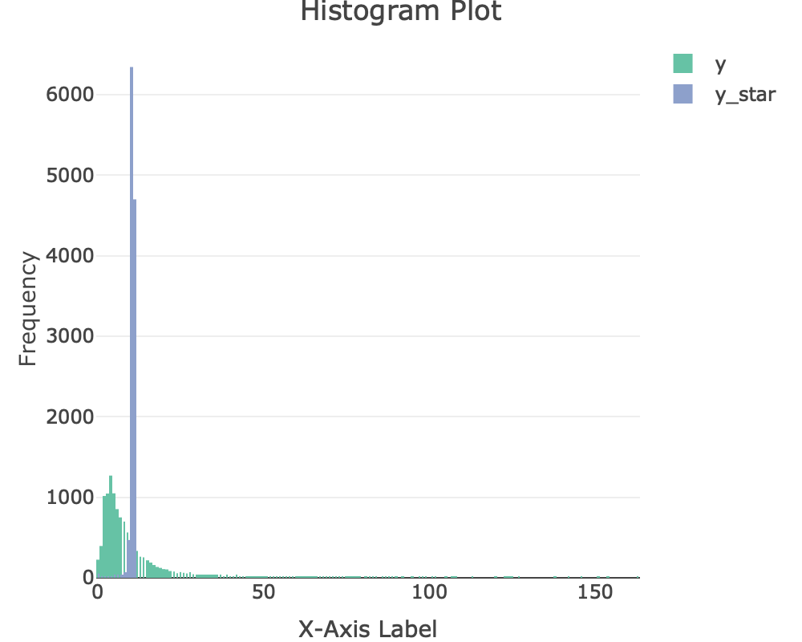

```{r, include=FALSE}
knitr::opts_chunk$set(echo = FALSE, warning = FALSE)
library(plotly)
library(tidyverse)
library(kableExtra)
library(htmlwidgets)
library(webshot)
#library(gridExtra)
```

```{r}
source("CodeSpace.R")
source("TestSpace.R")
```

# Introduction
An webpage designer might be interested in the goodness of the new design compared with the old one. In this project we were given a data set from a designed experiment. In this experiment, participants were randomly given a new webpage as the treatment or an old webpage as a control. Each participant decides if he/she wants to "convert", or in other words to make a decision. In addition, we treat each visitor's decision as independent. The result forms a random sample of Bernoulli trials. Suppose $X_1,...,X_n$ are the random sample of the visitor's choice, with $X_i=1$ if a visitor chooses to convert to the webpage assigned to him with probability $p$, otherwise $X_i=0$ with probability $1-p$. The success rate $p$ is the parameter of the Bernoulli distribution. Our goal is therefore to compare the success probabilities $p_1$ and $p_2$, where $p_1$ is the rate for the control group and $p_2$ is the rate for the treatment group.

We can have various hypothesis tests on the success probability $p$. One may consider a hypothesis test:

$$
H_0: ~ p_1 \leq p_2 \\
H_1: ~ p_1 > p_2
$$

such that we would like to know if the conversion rate for the old page is greater than the one for the new page. With Bayesian analysis one can evaluate directly the probability of the null and the alternative hypotheses. We can do this by using the Monte Carlo method to evaluate the following integral:

$$
P(p_1 > p_2 |\vec{x}) = \int_0^1 \int_0^1 \mathbb{I}(p_1 > p_2 |\vec{x}) \cdot f(p_1|\vec{x})f(p_2|\vec{x})dp_1 dp_2 = E[\mathbb{I}(p_1 > p_2 |\vec{x})]
$$

where $\mathbb{I}(p_1 \leq p_2|\vec{x})$ is the indicator function given the data and $f(p_1|\vec{x})$, $f(p_2|\vec{x})$ are the posterior Beta probability density functions for control and treatment respectively. To estimate this probability, one only needs to simulate pairs of Beta random variables from the two posterior distributions simultaneously, and calculate the average of the indicator function. 

The interpretation of a confidence interval is important. In a frequentist point of view, our unknown parameter $p$ is a true but fixed value. The confidence interval on the other hand is a random set, thus it is incorrect to state that we are 99% sure that the confidence interval covers the unknown true parameter. It is also incorrect to say that the unknown parameter falls within the confidence interval 99% of the time, because in this statement the unknown parameter is falsely treated as a random variable. Therefore the appropriate interpretation of the confidence interval is: when the experiment is repeated many times to generate random samples and their perspective confidence intervals, 99% of these confidence intervals will cover the unknown fixed parameter.

If we use the Bayesian approach to gain a different understanding of our unknown parameter and to draw inference on it, we then get the ($1-\alpha$)-level credible interval for the conversion rate based on the quantile of the posterior distribution as $[L(\vec{x}), R(\vec{x})]$ such that:
$$
\mathbb{P}(\textbf{p} \in [L(\vec{x}), R(\vec{x})] |\vec{x}) = \int_{L(\vec{x})}^{R(\vec{x})} f(p|\vec{x})dp = 1-\alpha
$$

With such definition, it is perfectly fine to interpret the credible interval as: the probability that our success rate falls within the given credible interval is (1-$\alpha$)%. 

Suppose we assume $Beta(\alpha, \beta)$ is the prior distribution of the success rate p. The prior density function is:
$$
f(p; \alpha,\beta) = \frac{\Gamma(\alpha+\beta)}{\Gamma(\alpha)\Gamma(\beta)} p^{\alpha-1} (1-p)^{\beta-1}, ~ p\in (0,1)
$$
We know the expectation and the variance of Beta distribution as:

\begin{gather*}
E(p)= \frac{\alpha}{\alpha+\beta}\\
Var(p)= \frac{\alpha \beta}{(\alpha+\beta)^2(\alpha+\beta+1)}
\end{gather*}

Thus if we assume that the average success rate is $t_1$ with a variance of $t_2$, then we can solve for the parameters of the prior distribution as 
$$
\alpha = - \frac{t_1}{t_2}\cdot (t_1^2-t_1+t_2), \quad \beta=\alpha \cdot \frac{1-t_1}{t_1}.
$$ 

Since the random sample $X_1,...,X_n$ follows Bernoulli(p) distribution, we have a conjugate pair of the prior and posterior distributions, i.e. the posterior distribution is $Beta(\alpha+\sum_{i=1}^n x_i, \beta+n-\sum_{i=1}^n x_i)$ with the mean and variance:

\begin{gather*}
E(p|\vec{x})=\frac{\alpha+\sum_{i=1}^n x_i}{\alpha+\beta+n}\\
Var(p|\vec{x})=\frac{(\alpha+\sum_{i=1}^n x_i)(\beta+n-\sum_{i=1}^n x_i)}{(\alpha+\beta+n)^2(\alpha+\beta+n+1)}
\end{gather*}

One can see that asymptotically when we have a large sample size n, the mean of the posterior distribution approaches to the maximum likelihood estimator $\hat{p} =\frac{1}{n}\sum_{i=1}^n x_i$. Thus the specification of a prior is less important if the sample size is large. This allows us to make a subjective assumption of the success rate based on a probability distribution instead of viewing it as a fixed but unknown number in the frequentist hypothesis test. In the case where $\alpha=\beta=1$, we obtain the non-informative prior $Beta(1,1)$, which is $Uniform([0,1])$ distribution. It's called non-informative because we assume that all p are equally probable. In other words, we no longer put a subjective assumption on $p$.

# Method

As the marketing people wanted to discover whether the new web page had a higher conversion rate than the old one, we collected a data set which contained users' visits and conversion information of the old and new web pages. In this project, we did a Bayesian AB test. The posterior distributions of old web page and new web page are stored and updated by continuously increasing the number of samples to form a new subset, as a way to determine whether the conversion rate of the new version is significantly better than that of the old version in each subset.

Before we did the Bayesian AB test, we noticed that there was some repetitive data like all the columns details are the same except the "timestamp" and some data error like "new-page" was in the "control" group, "old-page" was in the "treatment" group. So we pre-processed the data to solve these problems.
```{r}
ab_data<-read.csv("ab_data.csv", header = TRUE)

duplicates <- ab_data %>%
  group_by(user_id, group, landing_page, converted) %>%
  filter(n() > 1)
head(duplicates)

filtered_data <- ab_data %>%
  filter((group == "control" & landing_page == "new_page") |
         (group == "treatment" & landing_page == "old_page"))

head(filtered_data, 4)
```

```{r}
# Part 1
ab_data<-read.csv("ab_data.csv", header = TRUE)

#cleanning the data
old <- ab_data %>% filter(landing_page == "old_page" & group == "control")
new <- ab_data %>% filter(landing_page == "new_page" & group == "treatment")
old_distinct <- old %>% distinct(old$user_id, .keep_all = TRUE)
new_distinct <- new %>% distinct(new$user_id, .keep_all = TRUE)

# Part 2
mimic3d<-read.csv("mimic3d.csv", header = TRUE)%>%select(-c("gender","admit_location","AdmitDiagnosis","religion","marital_status","ethnicity","AdmitProcedure","LOSgroupNum"))%>%na.omit()
train_data<-mimic3d[1:47180,]
test_data<-mimic3d[47181:nrow(mimic3d),]
```

More specifically, based on the case of conversion rates of old and new pages, we show the derivation process from prior to posterior. From a business perspective, we want the conversion rate to be as high as possible. The goal of the experiment is to compare the advantages of the old and new pages in inducing visitor conversions. Imagine that as an individual web browser, conversions can only be yes or no. Each visitor obeys Bernoulli distribution. After removing repeated visits, the multiple independent Bernoulli distribution can be converted into a binomial distribution problem.  
Next we want to talk about the choice of prior distribution. In order to compare the old and new pages, we need to model the conversion rates of the old and new pages. Since the conversion rate is in $[0,1]$, we can choose the Beta distribution as the prior.  

Three reasons to choose Beta distribution: 

1. We observed that Beta distribution is located between 0 and 1. We think of the horizontal axis of the curve as the value of the probability of a transition occurring in a trial, and the vertical axis as the probability that that value will occur. This just fits our experimental design.  

2. The Beta distribution can take on various shapes by changing its parameters.  

3. When the likelihood obeys the binomial distribution and the prior obeys the Beta distribution, the posterior distribution is also a Beta distribution, which means that the prior and posterior are conjugate distributions and are easy to calculate. The advantage is that as the appearance of newly added samples, we can quickly derive the posterior distribution. This will be reflected in the third part.  

As mentioned above, when the prior is the Beta distribution and the likelihood is the binomial distribution, the posterior is also the Beta distribution, and has the advantage of convenient and fast calculation. The following fragment will provide a derivation process for this situation, aiming to reveal the relationship between the parameters of the posterior distribution and the parameters of the prior.  

From the above proof process, we conclude that if the prior distribution is $Beta(\alpha,\beta)$, the likelihood obeys the binomial distribution, then the posterior is $Beta(\alpha+s,\beta+n-s)$, where $n$ is the sample size, $s$ is the summation of converted. With this, we can form the model.

By tryinga prior of $Beta(2,20)$ in a Bayesian AB test, we get the distribution of conversion rates of new and old pages respectively, we approach the following conclusion.
For the choice of the parameters of the prior distribution, we had two cases: one was to use a non-informative prior, i.e., to assume that $Beta(1, 1)$ was the prior distribution of the data of the old and new web pages; the other was to use an informative prior, i.e., to assume that $Beta(2, 20)$ was the prior distribution of the data of the old and new web pages. 

We first took 100 samples to form the first subset and calculated the value (Mean of the proportion of new page's posterior distributions greater than old page's posterior distributions), posterior_old_mean and posterior_new_mean (the mean of the posterior distribution for the old and new web pages), posterior_old_se and posterior_new_se (standard error of the posterior distributions). 
Then, we took another 100 samples and add them to the first subset to form the second subset and computed the corresponding value, posterior_old_mean, posterior_new_mean, posterior_old_se and posterior_new_se. This was repeated until all the samples had been taken.

In order to compare the effects of non-infromative priors and informative priors on the posterior results. We ploted the scatter plots of size and value in the non-infomative priors and informative priors conditions respectively. The comparison revealed that in this dataset, the effect of whether the prior was infomative or not on the value value was almost zero. 

In addition, we could notice that as the sample size of subset increased, the value showed an overall decreasing trend, and finally almost fluctuated around 0.08. This illustrated that the new page was less effective relative to the old page and needed to be improved.
```{r}
old_distinct <- old %>% distinct(old$user_id, .keep_all = TRUE)
new_distinct <- new %>% distinct(new$user_id, .keep_all = TRUE)
visitor_to_old <- nrow(old_distinct)
visitor_to_new <- nrow(new_distinct)
conversion_old <- sum(old_distinct$converted)
conversion_new <- sum(new_distinct$converted)

alpha_prior <- 2
beta_prior <- 20

# calculate posterior
posterior_old <- rbeta(1000000, alpha_prior+conversion_old, beta_prior+visitor_to_old-conversion_old)
posterior_new <- rbeta(1000000, alpha_prior+conversion_new, beta_prior+visitor_to_new-conversion_new)

# calculate prob of new rate > old rate
cat("The probability of new page is better than the old page is",mean(posterior_new > posterior_old),"\n")

#Riemann sum as safety check:
sapply(seq(0.001,0.999, length.out=1000000), function(x){
    dbeta(x, alpha_prior+conversion_new,beta_prior+visitor_to_new-conversion_new)*
      pbeta(x, alpha_prior+conversion_old, beta_prior+visitor_to_old-conversion_old)})%>%sum()/1000000

```

At the same time, we calculate the expected values of the conversion rates of the old and new pages respectively as follows.
```{r}
posterior_Old <- data.frame(old_rate=c(posterior_old))
posterior_New <- data.frame(new_rate=c(posterior_new))
mean_old <- mean(posterior_Old$old_rate)
mean_new <- mean(posterior_New$new_rate)
cat("Mean of conversion rate on old page is", mean_old, "\n")
cat("Mean of conversion rate on new page is", mean_new, "\n")
```

In order to compare the conversion rates of the old and new pages more intuitively, we draw the obtained conversion rate distribution of the old and new pages in an individual graph.

```{r}
# plot density 
fig_2 <- ggplot() +
  geom_density(aes(x = posterior_Old$old_rate), fill = "blue", alpha = 0.5) +
  geom_density(aes(x = posterior_New$new_rate), fill = "red", alpha = 0.5) +
  geom_vline(xintercept = mean_old, linetype = "dashed", color = "blue") +
  geom_vline(xintercept = mean_new, linetype = "dashed", color = "red") +
  labs(title = "Probability Density Comparison", subtitle = "New page vs. old page",
       x = "Conversion rate",
       y = "Density") +
  annotate("text", x = 0.1187, y = 300, label= "New Page") +
  annotate("text", x = 0.1205, y = 300, label= "Old Page") +
  annotate("text", x = mean_old, y = 0, label = paste("mean of old\n", round(mean_old, 6)), vjust = 0.5, size = 3) +
  annotate("text", x = mean_new, y = 0, label = paste("mean of new\n", round(mean_new, 6)), vjust = 0.5, size = 3) +
  annotate("segment", x = mean_old, xend = mean_new, y = 510, yend = 510, colour = "black", linewidth = 1, arrow = arrow()) +
  annotate("text", x = (mean_old + mean_new)/2, y = 480, label = paste(round(mean_old-mean_new,6))) +
  scale_color_manual(values = c("red", "blue"), labels = c("new page", "old page"))

fig_2
```

The figure also shows the density function of the conversion rate of the new and old pages. We can see that compared to the old page, the probability density of the new page is shifted to the left. This implies that from an overall level, the performance of the new page is likely to be inferior to that of the old page. Furthermore, the expected conversion rate for the new page is `r mean_new`. However, the expected conversion rate for the old page is `r mean_old`. The conversion rate expectation for the new page is `r round(mean_old-mean_new,6)` lower than the conversion rate expectation for the old page.  

In terms of conversion rate performance, since the probability that the new page is better than the old page is only about `r mean(posterior_new > posterior_old)`. At the same time, the graphed information shows that the conversion rate expectation of the new page is actually lower than that of the old page. There is no significant evidence that changing to a new page will increase visitor conversion rates.

```{r}
#using non-informative priors
my_instance <- BayesianSample$new(old_distinct,new_distinct,rows_per_subset = 1000,
                           alpha_prior_old=1,
                           alpha_prior_new=1,
                           beta_prior_old=1,
                           beta_prior_new=1)

frame0<-my_instance$calculateMean()
ggplot(frame0, aes(x = size, y = value)) +
  geom_point(shape = 16, color = "blue") +
  labs(title = "Scatter Plot Example", x = "X-axis Label", y = "Y-axis Label")

#using informative priors, subset size = 100
my_instance <- BayesianSample$new(old_distinct,new_distinct,rows_per_subset = 1000,
                           alpha_prior_old=2,
                           alpha_prior_new=2,
                           beta_prior_old=20,
                           beta_prior_new=20)

frame1<-my_instance$calculateMean()
ggplot(frame1, aes(x = size, y = value)) +
  geom_point(shape = 16, color = "blue") +
  labs(title = "Scatter Plot Example", x = "X-axis Label", y = "Y-axis Label")

#combine the two plots
#combined_plot <- grid.arrange(plot0, plot1, ncol = 2)
#print(combined_plot)
```

Secondly, we plotted the image of the mean of posterior. The red line represented posterior_new_mean and the blue one represented posterior_old_mean. From the graph we noticed that when the sample size was in the range of around 200-12500, the value of posterior_new_mean was larger than the value of posterior_old_mean, i.e., new web page had higher conversion rates and the difference between the two conversion rates was quite large. However, when the sample size of the subset was larger than 12500, the blue line had been always higher than the red line, but the difference between the two was relatively small. From this, we could infer that overall, the conversion rate of the new web pages was lower than that of the old web page. This result was the opposite of what marketing people expected.
```{r}
#Mean_old & Mean_new Plot
result_mean <- frame1[, -which(names(frame1) == "value")]

#reorganize into long format
result_long1 <- gather(result_mean, key = "Variable", value = "Mean", posterior_old_mean:posterior_new_mean)

ggplot(result_long1, aes(x = size, y = Mean, color = Variable)) +
  geom_line() +
  labs(title = "Mean Comparison",
       x = "Size",
       y = "Mean") +
  scale_color_manual(values = c("posterior_old_mean" = "blue", "posterior_new_mean" = "red"))
```

Finally, we ploted the 95% confidence intervals for each subset of posterior_new_mean and posterior_old_mean. As the sample size of the subset increased, the range of the confidence intervals (the range of the light blue area on the graph) becomed gradually narrower, indicating that: the larger the sample size of the subset, the smaller the error caused by sampling, the closer the posterior_new_mean and posterior_old_mean were to the true value, and the results were more reliable.
```{r}
# Plot Credible Interval
my_instance$PlotCI()%>%print()
```

```{R}
# Transform categorical data
mimic3d_clean <- na.omit(subset(read.csv("mimic3d.csv", header = TRUE),select = c(LOSdays, gender, admit_type, insurance, ExpiredHospital)))
cate_data <- mimic3d_clean %>% transmute(
  LOSdays_Less2 = factor(ifelse(LOSdays < 2, 1, 0)), 
  gender = factor(gender, levels = c("F", "M")), 
  admit_type = factor(admit_type, levels = c("ELECTIVE","EMERGENCY","NEWBORN","URGENT")),
  insurance = factor(insurance, levels = c("Government","Medicaid","Medicare","Private","Self Pay")),
  ExpiredHospital=factor(ExpiredHospital))

# Chi_square_test on category variables
CategoryTest <- CategoryDependence$new(cate_data, 
                                       predictor_x=c("gender","admit_type","insurance","ExpiredHospital"),
                                       response_y="LOSdays_Less2")
CategoryTest$p_value
```

```{r}
#Model selection
predictor_x<-c("age","NumCallouts","NumDiagnosis","NumProcs","NumCPTevents",
               "NumInput","NumLabs","NumMicroLabs","NumNotes","NumOutput",
               "NumRx","NumProcEvents","NumTransfers","NumChartEvents","TotalNumInteract")
response_y<-c("LOSdays")

candidates<-list()
#for(i in 1:10){
#  predx<-c(predictor_x[sample(1:length(predictor_x), 5)])
#  RegressionTest<-BayesianRegression$new(train_data, responseV=c("LOSdays"), predictorV=predx, prior_sigma=c(8,10), prior_beta=list(m=rep(0,6), V=diag(nrow = 6)) )
#  rss<-RegressionTest$PredictiveCheck(train_data)
#  candidates[[i]]<-c(predx, rss)
#}
```

```{r}
#Bayesian Regression Analysis
RegressionTest<-BayesianRegression$new(train_data, c("LOSdays"), c("NumTransfers"), prior_sigma=c(8,10), prior_beta=list(m=c(0,0), V=matrix(c(10,3,4,6), nrow=2, byrow = TRUE)) )
RegressionTest$PosteriorPlot()%>%print()
PredictP<-RegressionTest$PredictionPlot(test_data)

saveWidget(widget = PredictP, file = "./Figures/PredictP.html")
shots<-webshot(url = "./Figures/PredictP.html", file = "./Figures/PredictP.png", delay = 1, zoom = 2, vheight = 400, vwidth = 500)
```

```{r, echo=FALSE, fig.align='center', fig.cap = "Prediction Plot"}

```


# References